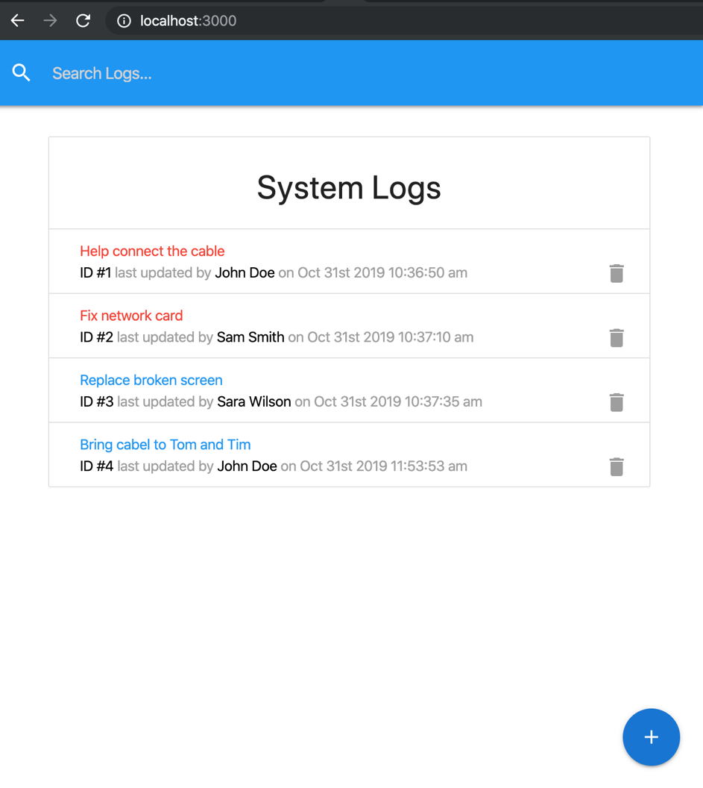
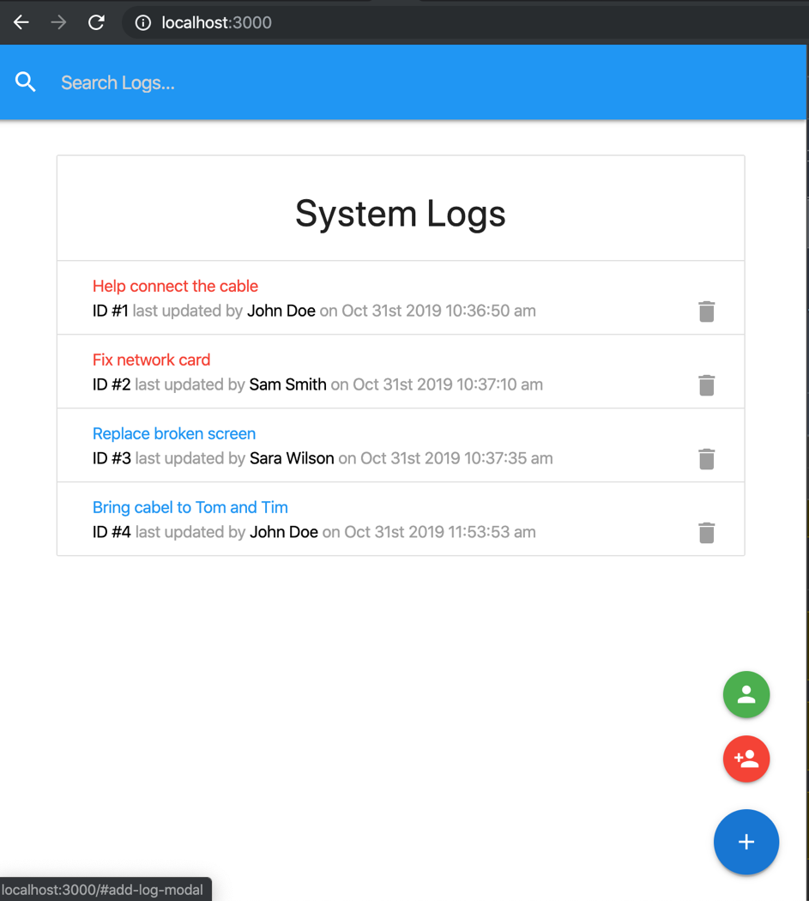
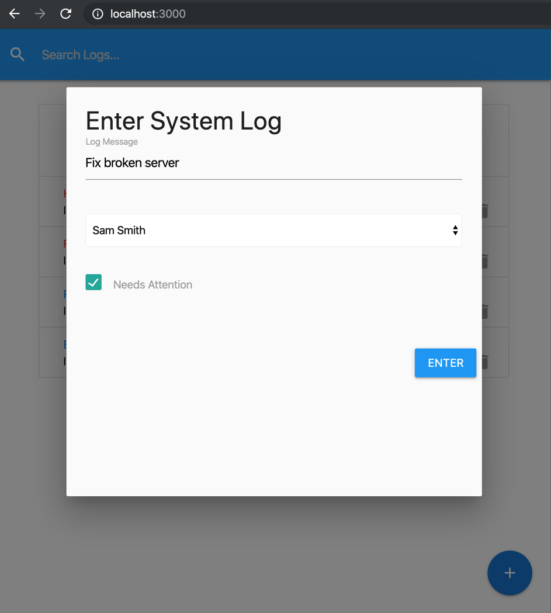
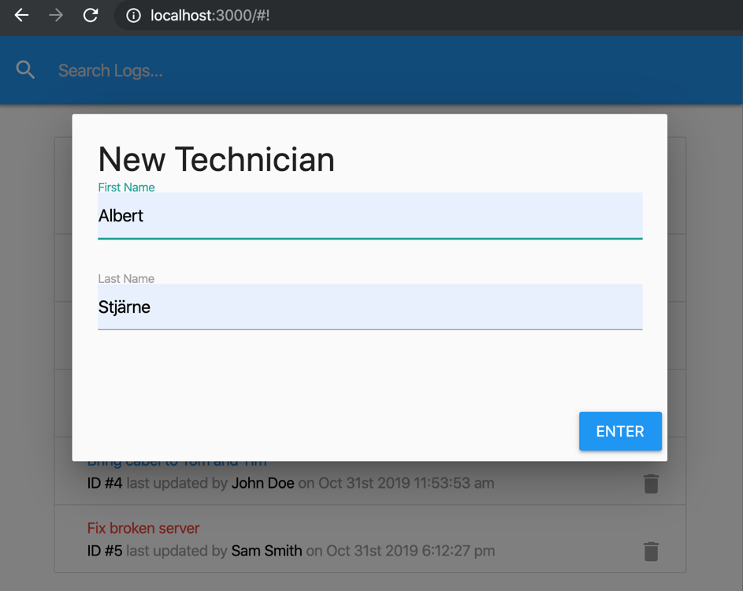
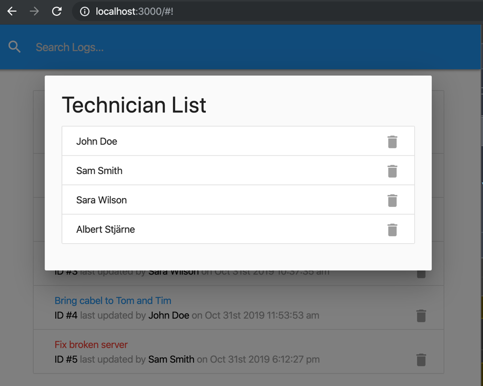
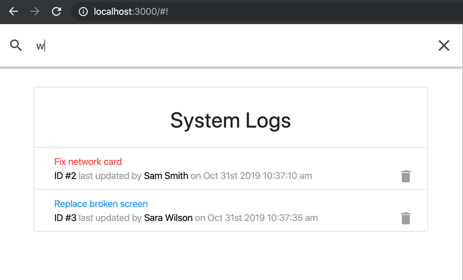

# A log for Technicians built in Reach

A ticket system where Technicians can add, edit and delete logs. The logs has a needs attention flag. New Technicians can be added and deleted.

The app has an instant search where the search runs for each letter added.

Materialize-css has been used for the UI.

json-server has been used to mimic a backend.

 
 

## Using create-react-app

The project was initialized with create-react-app, [Create React App](https://github.com/facebook/create-react-app)

# Instructions to run the application

Run these commands in the project directory: 
Installing dependencies 
`$ npm install`

Starting the application in development mode 
`$ npm run dev`

This should open the application in the browser, otherwise go to: 
[http://localhost:3000](http://localhost:3000) 
The page will reload if you make code edits.

# Screenshots

List of logs
 

 
Bottom right corner meny for adding logs, adding tech person and listing the techs
 

 
Modal for adding new log
 

 
Modal for adding new Technician

 
Modal for listing technicians, where they also can be deleted

 
The search is instant, thus searching as soon as something is entered

 

## Author

- Albert Stjärne (https://github.com/AlbertStjarne)
